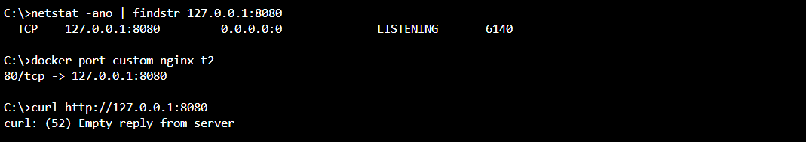
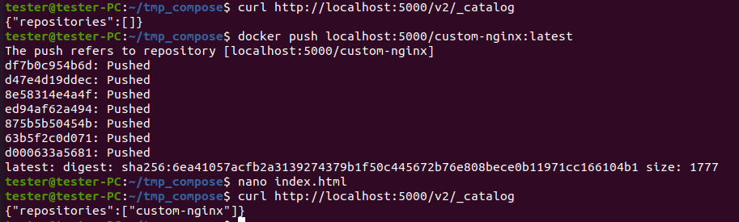

# Домашнее задание к занятию «Оркестрация группой Docker контейнеров на примере Docker Compose»

https://github.com/netology-code/virtd-homeworks/blob/shvirtd-1/05-virt-03-docker-intro/README.md

## Задача 1
Сценарий выполнения задачи:
- Установите docker и docker compose plugin на свою linux рабочую станцию или ВМ.
- Если dockerhub недоступен создайте файл /etc/docker/daemon.json с содержимым: ```{"registry-mirrors": ["https://mirror.gcr.io", "https://daocloud.io", "https://c.163.com/", "https://registry.docker-cn.com"]}```
- Зарегистрируйтесь и создайте публичный репозиторий  с именем "custom-nginx" на https://hub.docker.com (ТОЛЬКО ЕСЛИ У ВАС ЕСТЬ ДОСТУП);
- скачайте образ nginx:1.21.1;
- Создайте Dockerfile и реализуйте в нем замену дефолтной индекс-страницы(/usr/share/nginx/html/index.html), на файл index.html с содержимым:
```
<html>
<head>
Hey, Netology
</head>
<body>
<h1>I will be DevOps Engineer!</h1>
</body>
</html>
```
- Соберите и отправьте созданный образ в свой dockerhub-репозитории c tag 1.0.0 (ТОЛЬКО ЕСЛИ ЕСТЬ ДОСТУП). 
- Предоставьте ответ в виде ссылки на https://hub.docker.com/<username_repo>/custom-nginx/general .

## Решение 1

1. Устанавливаем docker-desktop по инструкции https://docs.docker.com/get-started/introduction/get-docker-desktop/
2. Регистрируемся на https://hub.docker.com
3. Загружаем образ nginx
   1. `docker pull nginx:1.21.1`
4. Создаём файл index.html с нужным содержимым
5. Создаём Dockerfile
   1. FROM nginx:1.21.1
   2. COPY index.html /usr/share/nginx/html/
6. Собираем образ
   1. `docker build -t custom-nginx:1.0.0 .`
7. Готовим креды для логина, получая их на https://hub.docker.com
8. `docker login -u spardoks`
9. Готовим образ для отправки
   1. `docker tag custom-nginx:1.0.0 spardoks/custom-nginx:1.0.0`
10. Отправляем
    1.  `docker push spardoks/custom-nginx:1.0.0`

https://hub.docker.com/repository/docker/spardoks/custom-nginx

## Задача 2
1. Запустите ваш образ custom-nginx:1.0.0 командой docker run в соответвии с требованиями:
- имя контейнера "ФИО-custom-nginx-t2"
- контейнер работает в фоне
- контейнер опубликован на порту хост системы 127.0.0.1:8080
2. Не удаляя, переименуйте контейнер в "custom-nginx-t2"
3. Выполните команду ```date +"%d-%m-%Y %T.%N %Z" ; sleep 0.150 ; docker ps ; ss -tlpn | grep 127.0.0.1:8080  ; docker logs custom-nginx-t2 -n1 ; docker exec -it custom-nginx-t2 base64 /usr/share/nginx/html/index.html```
4. Убедитесь с помощью curl или веб браузера, что индекс-страница доступна.

## Решение 2

1. `docker run -d --name KVA-custom-nginx-t2 -p 127.0.0.1:8080:80 spardoks/custom-nginx:1.0.0`
2. `docker rename KVA-custom-nginx-t2 custom-nginx-t2`
3. Выполняем команды 

4. curl 127.0.0.1:8080
```
C:\>curl 127.0.0.1:8080
<html>
<head>
Hey, Netology
</head>
<body>
<h1>I will be DevOps Engineer!</h1>
</body>
</html>
```

## Задача 3
1. Воспользуйтесь docker help или google, чтобы узнать как подключиться к стандартному потоку ввода/вывода/ошибок контейнера "custom-nginx-t2".
2. Подключитесь к контейнеру и нажмите комбинацию Ctrl-C.
3. Выполните ```docker ps -a``` и объясните своими словами почему контейнер остановился.
4. Перезапустите контейнер
5. Зайдите в интерактивный терминал контейнера "custom-nginx-t2" с оболочкой bash.
6. Установите любимый текстовый редактор(vim, nano итд) с помощью apt-get.
7. Отредактируйте файл "/etc/nginx/conf.d/default.conf", заменив порт "listen 80" на "listen 81".
8. Запомните(!) и выполните команду ```nginx -s reload```, а затем внутри контейнера ```curl http://127.0.0.1:80 ; curl http://127.0.0.1:81```.
9. Выйдите из контейнера, набрав в консоли  ```exit``` или Ctrl-D.
10. Проверьте вывод команд: ```ss -tlpn | grep 127.0.0.1:8080``` , ```docker port custom-nginx-t2```, ```curl http://127.0.0.1:8080```. Кратко объясните суть возникшей проблемы.
11. * Это дополнительное, необязательное задание. Попробуйте самостоятельно исправить конфигурацию контейнера, используя доступные источники в интернете. Не изменяйте конфигурацию nginx и не удаляйте контейнер. Останавливать контейнер можно. [пример источника](https://www.baeldung.com/linux/assign-port-docker-container)
12. Удалите запущенный контейнер "custom-nginx-t2", не останавливая его.(воспользуйтесь --help или google)

## Решение 3

1. Для подключению к стандартному потоку контейнера: `docker attach custom-nginx-t2`
2. После выполнения комбинации Ctrl+C произошло отсоедение от контейнера
3. При нажатии Ctrl+C контейнер остановился, так как это стандартный сигнал завершения процесса
4. Для перезапуска: `docker restart custom-nginx-t2`
5. Для ввода команд в контейнере: `docker exec -it custom-nginx-t2 bash`
6. Для установки nano: apt udpate && apt install nano
7. Поменяли порт nginx внутри контейнера и перезагрузили его конфигурацию
8. Теперь при вполнении внутри контейнера curl http://127.0.0.1:80 ; curl http://127.0.0.1:81 получаем ошибку на первый запрос и успешный ответ на второй
9. Успешно вышли из контейнера при помощи exit, и он продолжил работать
10. При выполнении curl http://127.0.0.1:8080 вне контейнера теперь получаем curl: (52) Empty reply from server, потому что nginx в контейнере слушает порт 81, а мы посылаем запрос на 80

11. Итак, есть несколько способов поменять маппинг портов для контейнера: перезапустить его и указать изменения, сделать коммит и создать новый контейнер с изменениями в портах, и попробовать изменить конфигурационные файлы `/var/lib/docker/containers/<ID>/config.v2.json` и `/var/lib/docker/containers/<ID>/hostconfig.json`
12. Для принудительно удаления без остановки: `docker rm -f custom-nginx-t2`

## Задача 4
- Запустите первый контейнер из образа ***centos*** c любым тегом в фоновом режиме, подключив папку  текущий рабочий каталог ```$(pwd)``` на хостовой машине в ```/data``` контейнера, используя ключ -v.
- Запустите второй контейнер из образа ***debian*** в фоновом режиме, подключив текущий рабочий каталог ```$(pwd)``` в ```/data``` контейнера. 
- Подключитесь к первому контейнеру с помощью ```docker exec``` и создайте текстовый файл любого содержания в ```/data```.
- Добавьте ещё один файл в текущий каталог ```$(pwd)``` на хостовой машине.
- Подключитесь во второй контейнер и отобразите листинг и содержание файлов в ```/data``` контейнера.

## Решение 4

1. `docker run -d -it --name centos -v $(pwd):/data centos:8 bash`
2. `docker run -d -it  --name debian -v $(pwd):/data debian:latest bash`
3. `docker exec -it centos bash`
   1. cd data
   2. echo "Hello" > 1.txt
   3. exit
4. echo "Hello2" > 2.txt
5. `docker exec -it debian bash`
   1. cd data
   2. ls
   3. Появилось 2 файла: 1.txt, 2.txt с содержимым из прошлых шагов

## Задача 5
1. Создайте отдельную директорию(например /tmp/netology/docker/task5) и 2 файла внутри него.
"compose.yaml" с содержимым:
```
version: "3"
services:
  portainer:
    network_mode: host
    image: portainer/portainer-ce:latest
    volumes:
      - /var/run/docker.sock:/var/run/docker.sock
```
"docker-compose.yaml" с содержимым:
```
version: "3"
services:
  registry:
    image: registry:2

    ports:
    - "5000:5000"
```

И выполните команду "docker compose up -d". Какой из файлов был запущен и почему? (подсказка: https://docs.docker.com/compose/compose-application-model/#the-compose-file )

2. Отредактируйте файл compose.yaml так, чтобы были запущенны оба файла. (подсказка: https://docs.docker.com/compose/compose-file/14-include/)

3. Выполните в консоли вашей хостовой ОС необходимые команды чтобы залить образ custom-nginx как custom-nginx:latest в запущенное вами, локальное registry. Дополнительная документация: https://distribution.github.io/distribution/about/deploying/
4. Откройте страницу "https://127.0.0.1:9000" и произведите начальную настройку portainer.(логин и пароль адмнистратора)
5. Откройте страницу "http://127.0.0.1:9000/#!/home", выберите ваше local  окружение. Перейдите на вкладку "stacks" и в "web editor" задеплойте следующий компоуз:

```
version: '3'

services:
  nginx:
    image: 127.0.0.1:5000/custom-nginx
    ports:
      - "9090:80"
```
6. Перейдите на страницу "http://127.0.0.1:9000/#!/3/docker/containers", выберите контейнер с nginx и нажмите на кнопку "inspect". В представлении <> Tree разверните поле "Config" и сделайте скриншот от поля "AppArmorProfile" до "Driver".

7. Удалите любой из манифестов компоуза(например compose.yaml).  Выполните команду "docker compose up -d". Прочитайте warning, объясните суть предупреждения и выполните предложенное действие. Погасите compose-проект ОДНОЙ(обязательно!!) командой.

## Решение 5

На Winodws portainer не удалось сходу завести. Перейдём на Linux

1. Запустился `compose.yaml`, так как по-умолчанию в первую очередь берётся это файл согласно документации docker при использовании compose плагина
2. Редактируем файл `compose.yaml`, добавив в конец следующие строки для включения `docker-compose.yaml`
```
include:
  - "./docker-compose.yaml"
```
3. Заливаем custom-nginx в local registry
   1. docker compose up -d
   2. curl http://localhost:5000
   3. docker pull spardoks/custom-nginx:1.0.0
   4. docker tag spardoks/custom-nginx:1.0.0 localhost:5000/custom-nginx:latest
   5. docker push localhost:5000/custom-nginx:latest
   6. curl http://localhost:5000/v2/_catalog

4. Создали пользователя admin для portainer

5. Создаём mycompose

6. Инспектим контейнер

7. Удаляем compose.yaml и пытаемся запустить docker compose up -d

```
WARN[0000] /home/tester/tmp_compose/docker-compose.yaml: `version` is obsolete
Это предупреждение означает, что версия формата файла docker-compose.yaml устарела.

WARN[0000] Found orphan containers ([tmp_compose-portainer-1]) for this project
Это предупреждение указывает на то, что существует контейнер (tmp_compose-portainer-1), который был создан для этого проекта, но сейчас отсутствует в файле docker-compose.yaml.
```
Чтобы погасить compose проект
```
# если compose файл не изменялся
docker compose down

# если compose файл изменился - наш случай
docker compose down --remove-orphans
```